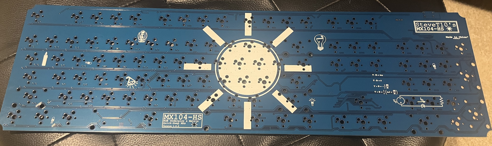
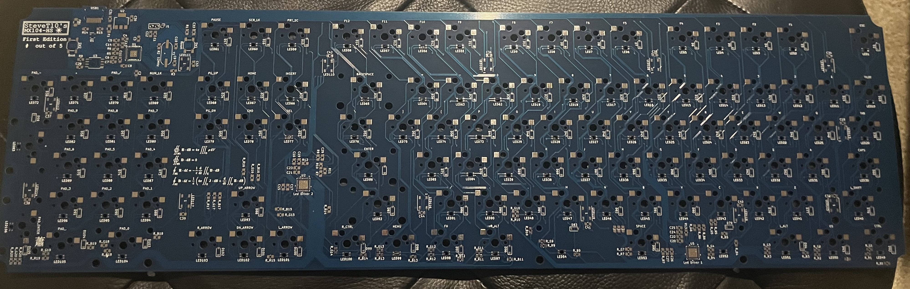

# MX104-HS

A 104-key mechanical keyboard that I designed for myself. This keyboard currently features Hot Swappable Switches, RGB underglow, and RGB backlighting. The hardware was designed by me in KiCad and Autodesk Fusion360. The keyboard currently runs on QMK firmware, an open-sourced keyboard firmware.

## Goal
This project's goal is to act as a progressive learning project that complements my education in Computer Engineering. The first goal of this project was to familiarize myself with hardware design, where I would learn: 
- How PCBs are designed and fabricated.
- How to design circuit schematics and PCB layout in EDA software, specifically KiCad.
- How to design a basic case model in CAD software, specifically Autodesk Fusion360

After verifying my hardware design and solving any potential issues, I would move onto the second goal of this project which is learn more about firmware, more specifically:

- How to program C/Assembly in ARM-based MCU.
- How communication protocals such as I2C are implemented.
- Potentially more (As I have not gotten to this stage yet)

## (IN-PROGRESS) Current Version (v1.0)
This version is still in progress, most but not all components have arrived. Additionally, I need to setup QMK firmware and model the keycaps for 3D printiing them. I will document any issues or notes I find, while assemblying the keyboard.

The current version is 2 layer PCB that uses a USB-C port, a RP2040 as the brain, and 2 LED driver ICs to control the backlighting. Underglow uses addressable leds and is directly controlled by the RP2040. The firmware is currently based on QMK firmware. Some potential issues with this version are:

- The arc notches at the PCB corners are meant to secure the PCB to board, however these arcs are so small that they are effectively useless.
- Top plates are potentially incompatible, the placement of switches did not account for this at the time of design.

Front Side of PCB

Back Side of PCB (Unpopulated)

## Creating Gerbers
Most PCB fabrication places expect gerber files. Gerber files describe the layout of pads, traces, drill holes, and other geometry for each layer on the PCB. Gerber files should be uploaded in a compress zip file containing all layers. To create gerber files in KiCad v7.0:

1. Open KiCad's PCB viewer
2. Go to `File` -> `Plot`
3. Select layers and options accordingly to your fabrication shop's settings. I chose JLCPCB so I set the following options below and set all others to unchecked.
    * Include Layers:
        * F.Cu
        * B.Cu
        * F.Paste
        * B.Paste
        * F.Silkscreen
        * B.Silkscreen
        * F.Mask
        * B.Mask
        * Edge.cuts
    * `Plot reference designators`
    * `Plot footprint values`
    * `Use Protel filename extensions`
    * `Subtract soldermask from silkscreen`
    * Check zone fills before plotting.
4. Set the output directory to `project-name-gerbers`, where project name is a placeholder.
5. Click `Plot` to generate layer gerbers.
6. Click `Generate Drill files...`
7. Again, select options that match with your fabrication shop's specifications. For JLCPCB, this is:
    * Drill File Format set to Excellon.
    * Oval Holes Drill Mode is set to `Use alternate drill mode`
    * Map File Format set to `Gerber`
    * Drill Origin set to `Absolute`
    * Drill units set to `Millimeters`
    * Zeros format set to `Decimal format`
8. Click `Generate Drill File`
9. Zip up your gerber files and now it is ready for upload.

